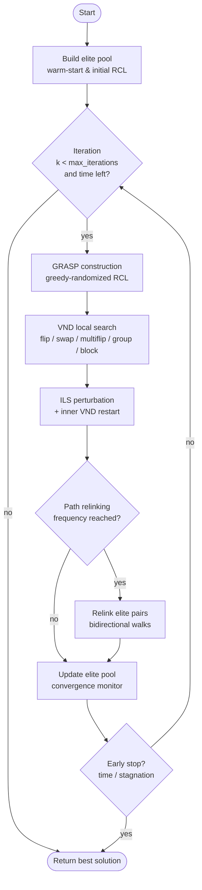

# Algorithm overview

`givp` is a hybrid metaheuristic that nests four classical components inside
a single outer loop. Understanding how they interact helps you tune the
configuration for your problem.

## High-level pipeline

## Components

### GRASP — Greedy Randomized Adaptive Search Procedure

At each outer iteration a fresh candidate is built coordinate-by-coordinate
from a **Restricted Candidate List (RCL)**. The size of the RCL is controlled
by `alpha` (0 = pure greedy, 1 = pure random). When `adaptive_alpha=True`,
`alpha` is jittered around its mean to avoid local-optimum traps caused by
a fixed greediness.

### VND — Variable Neighborhood Descent

Once a candidate exists, `local_search_vnd` drains every available
neighbourhood until none of them yields improvement:

| Neighbourhood | Acts on | Behaviour |
|---------------|---------|-----------|
| `flip` | one variable | first-improvement single-coordinate move |
| `swap` | two variables | exchange of two coordinates |
| `multiflip` | k variables | block of k coordinates flipped at once |
| `group` | grouped vars | symmetric perturbation across a group |
| `block` | grouped vars | contiguous block of groups perturbed in unison |

`group`/`block` are activated automatically when the configuration provides a
`group_size`. The adaptive variant (`local_search_vnd_adaptive`) tracks the
hit-rate of each neighbourhood and reorders them between calls, giving more
budget to the ones that pay off for *this* problem.

### ILS — Iterated Local Search

When VND stalls, ILS perturbs the current solution and runs VND again. The
perturbation strength scales with `ils_perturb_strength`; a Boltzmann-style
temperature lets a worsening move be accepted occasionally to escape plateaus.

### Path Relinking

Every `path_relink_frequency` iterations the algorithm picks pairs of elite
solutions and walks a **bidirectional** path between them, evaluating each
intermediate point. Strong attractors are reinforced; the elite pool is
updated with any improvement found along the way.

### Supporting infrastructure

* **`EvaluationCache`** — LRU on the (tuple of rounded) input vector to avoid
  re-evaluating revisited solutions. Reports hit/miss stats when `verbose=True`.
* **`ConvergenceMonitor`** — detects stagnation; can either trigger an
  early stop or force a heavy perturbation.
* **`ElitePool`** — diversity-aware pool that prefers candidates that are both
  good *and* far from existing members in Hamming/Euclidean distance.

## Tuning checklist

1. **Black-box, expensive evaluator?** Enable `use_cache=True` (default) and
   reduce `vnd_iterations`.
2. **Mixed continuous/integer model?** Set `integer_split=k` so the integer
   coordinates use rounded RCLs.
3. **Long-running production run?** Set `time_limit=N` and increase
   `max_iterations`; ILS will exit cleanly when the deadline arrives.
4. **Multimodal landscape?** Enable `adaptive_alpha=True` and raise
   `path_relink_frequency`.
5. **Need reproducible benchmarks?** Pass `seed=42` (or any int) to
   `grasp_ils_vnd_pr` / `GraspOptimizer`.
